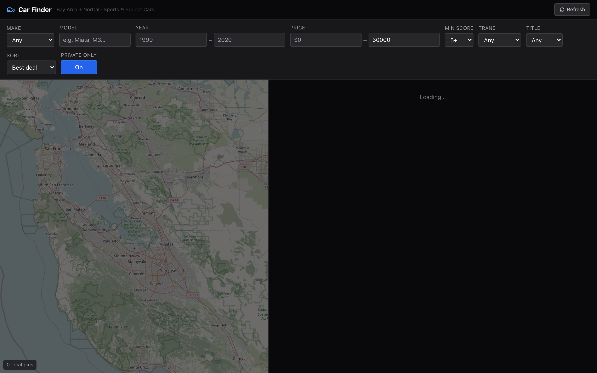

# Car Finder

[](https://github.com/Lucassnam/car-finder/actions/workflows/ci.yml)

A personal dashboard that scrapes used car listings, enriches them with a local
AI model, and surfaces genuinely good deals on sports, project and classic cars
around the Bay Area, without the SUV, Prius, dealer and ad noise.



<sub>Screenshot shows the dashboard shell with the backend stopped, so the map
and result list are empty. Start the API to populate them.</sub>

## What makes it different

Most listing aggregators rank by price. This one ranks by **deal**, and it does
the reasoning locally.

- **Sources:** Craigslist across the Bay Area and driveable NorCal, Bring a
  Trailer, Cars and Bids, eBay Motors
- **AI runs on your own GPU** through [Ollama](https://ollama.com). No API cost,
  no listing data leaving your machine
- **Deal score, 1 to 10**, grounded in real sold prices mined from Bring a
  Trailer, Cars and Bids and eBay, then normalised to local fair value
- **Per listing:** parsed specs, private seller versus dealer detection, red
  flags for salvage, rebuilt and high mileage, model specific known quirks, and
  a tailored list of questions to ask the seller
- **Dashboard:** split view with a map of local cars beside a filterable scored
  list of everything

## Status

Honest about where it is. Phase 0 is committed and builds; the rest is planned.

| Phase | Scope | Status |
| --- | --- | --- |
| 0 | Project scaffold, dependencies, installer, models, database | Done |
| 1 | Craigslist, AI extraction, scored list UI | Next |
| 2 | Sold comps backfill from BaT and Cars and Bids, deal rating engine | Planned |
| 3 | Map, auctions, eBay API, saved searches, alerts | Planned |
| 4 | Vision for odometer and title, sold comps explorer, polish | Planned |

## Stack

Python, FastAPI, Playwright and httpx for scraping, APScheduler, PostgreSQL with
PostGIS, Ollama running Qwen2.5 and Llama Vision, Next.js, Tailwind CSS and
MapLibre on the front end.

## Setup

See **[SETUP.md](SETUP.md)**. One command installs every tool, library and model
on macOS or Windows.

```bash
# macOS
bash scripts/setup.sh
```

```powershell
# Windows
.\scripts\setup.ps1
```

## Checks

```bash
python -m compileall backend/app   # backend syntax
cd frontend && npm ci && npm run build
```

Both run on every push through GitHub Actions.
